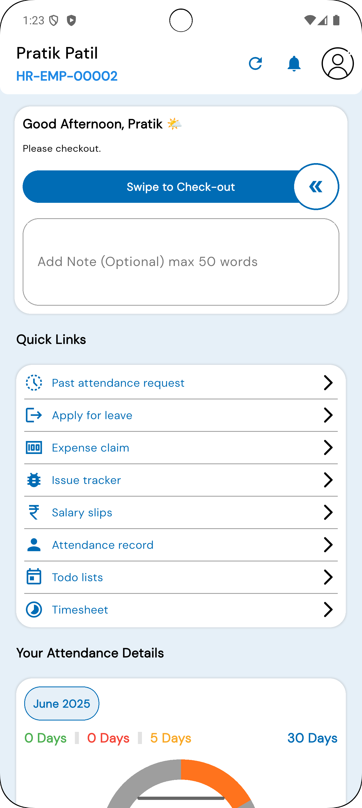
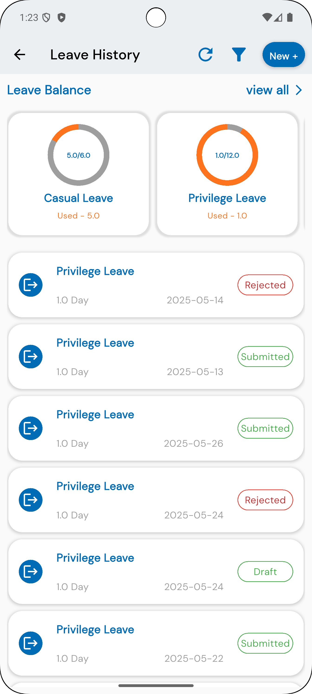
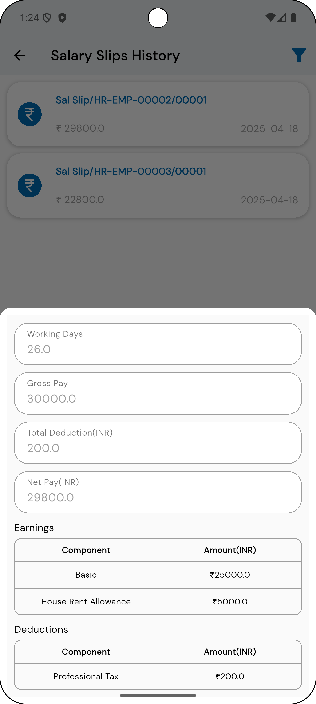
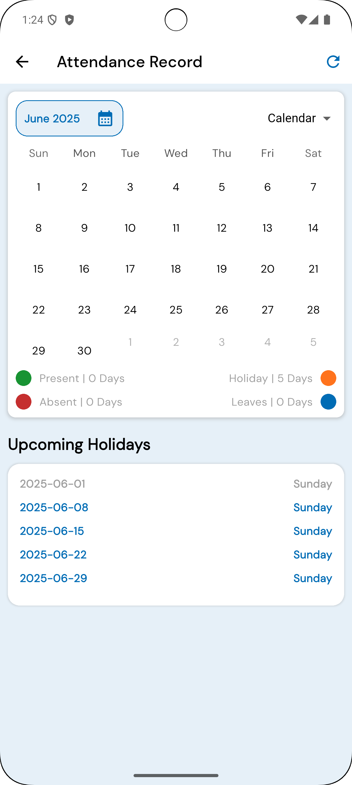

**Ampower FaceIT**

Ampower FaceIT is a comprehensive employee management app built on Flutter, designed to integrate seamlessly with ERPNext as the backend and Firebase for notifications. It provides essential features for employees, such as attendance tracking, leave applications, expense claims, and more.

**Features**

- Employee Check-in/Check-out: Record work hours with easy check-in and check-out functionality.
- Attendance Management: View past attendance requests and monthly attendance details.
- Leave Application: Apply for leave directly within the app.
- Expense Claims: Submit expense claims with ease.
- Issue Tracker: Track and report issues for faster resolution.
- Salary Slips: Access monthly salary slips.
- Task Management: Manage tasks with a to-do list and timesheet functionality.

## Screenshots

<p float="left">
  
  
  
  
</p>

**Tech Stack**

- Frontend: Flutter, Dart
- Backend: ERPNext

**Installation**

To set up and run the project, you’ll need to have [Flutter](https://flutter.dev/docs/get-started/install), [Dart](https://dart.dev/get-dart), and [Android Studio](https://developer.android.com/studio) (or another compatible IDE) installed.

1. **Clone the Repository**:
   ```bash
   git clone https://github.com/your-username/ampower-faceit.git
   cd ampower-faceit
   ```

2. **Install Dependencies**:
   ```bash
   flutter pub get
   ```

3. **Configure Backend**:
    - Set up ERPNext and configure your backend settings in the app.
    - Configure Firebase for push notifications as per the [Firebase documentation](https://firebase.google.com/docs/flutter/setup).

**Usage**

*Building APK for Android*  
To build the Android APK, use the following command:
```bash
flutter build apk --release
```

*Building IPA for iOS*  
To build the iOS IPA, ensure that you are on macOS with Xcode installed, then use:
```bash
flutter build ios --release
```
